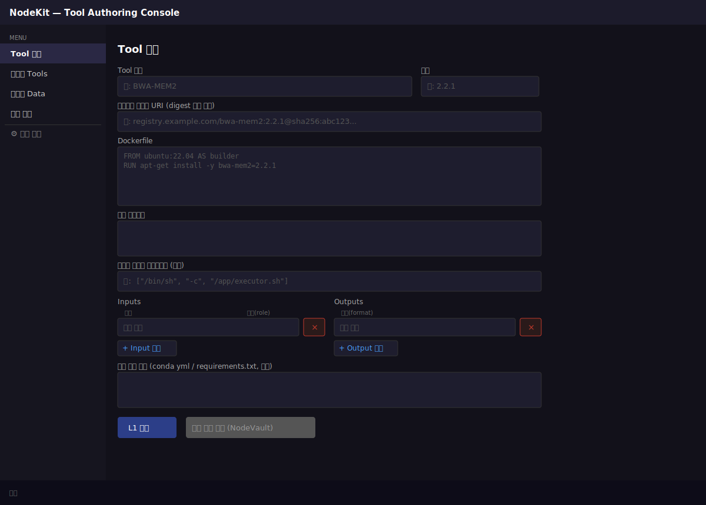
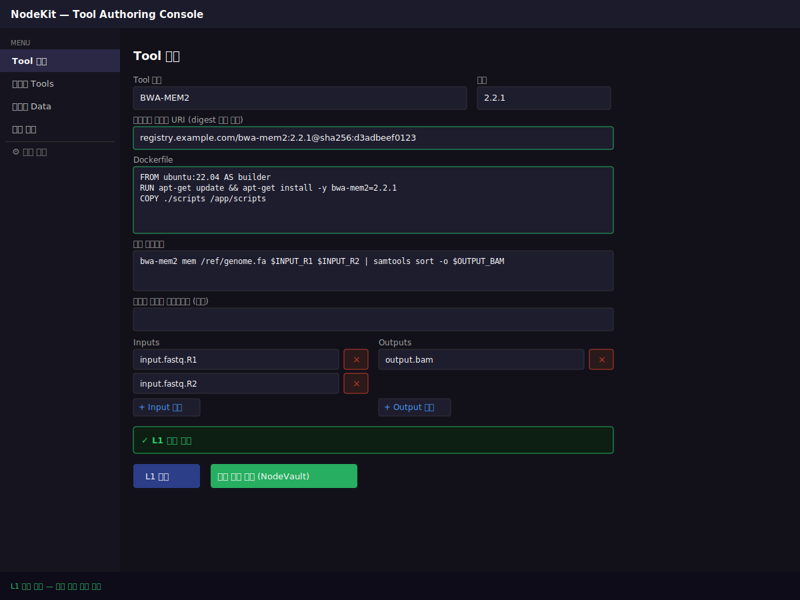
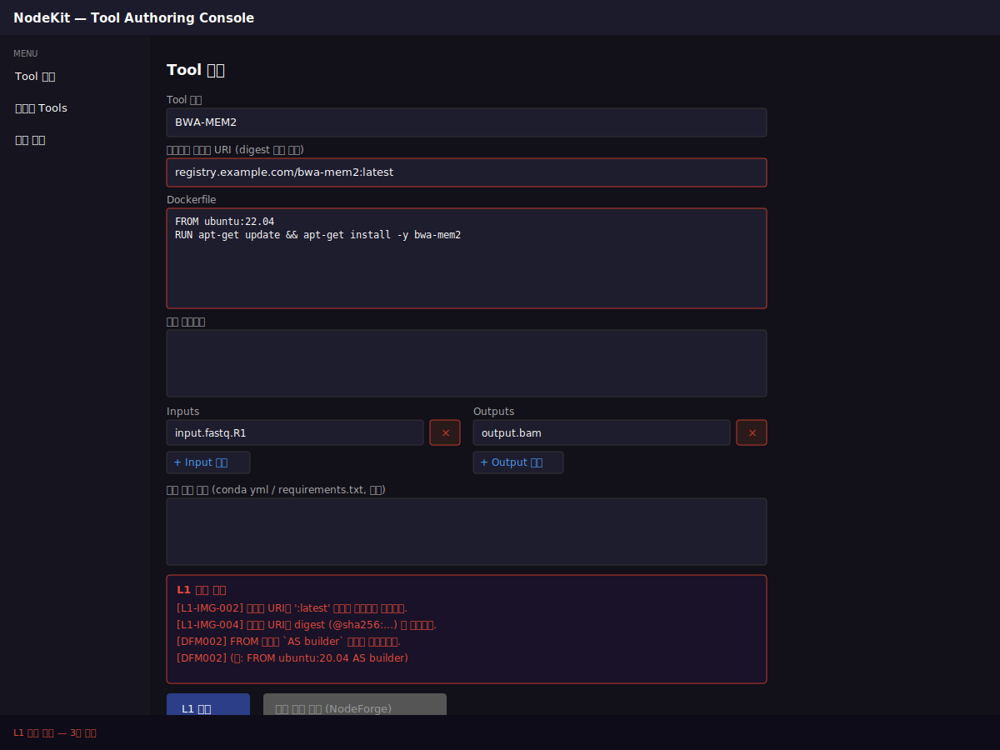
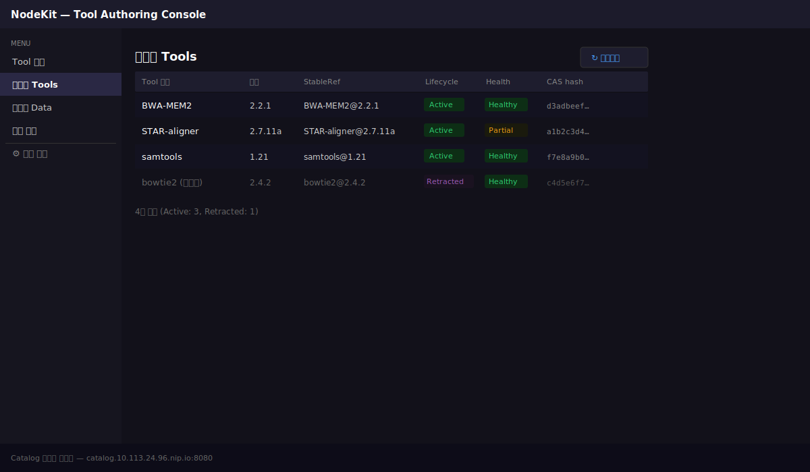
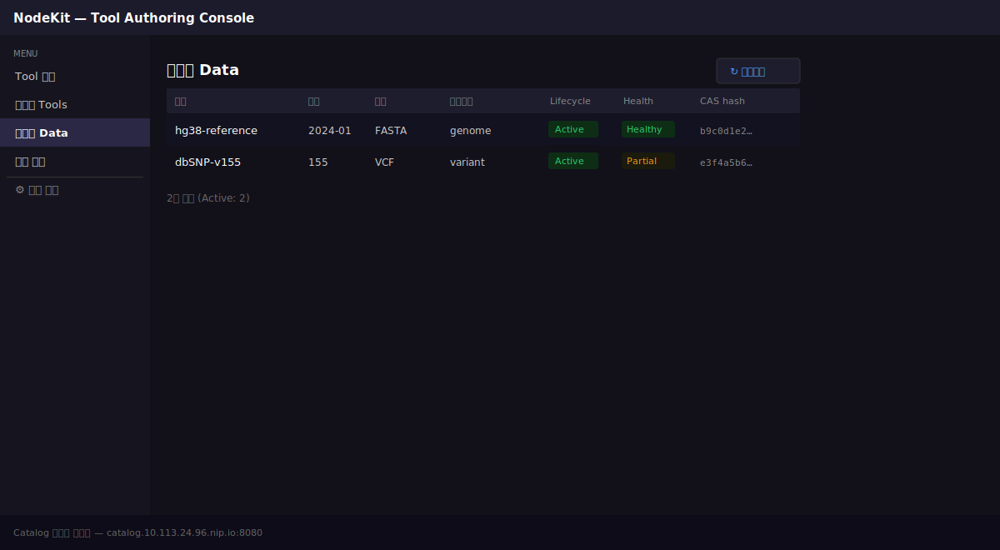
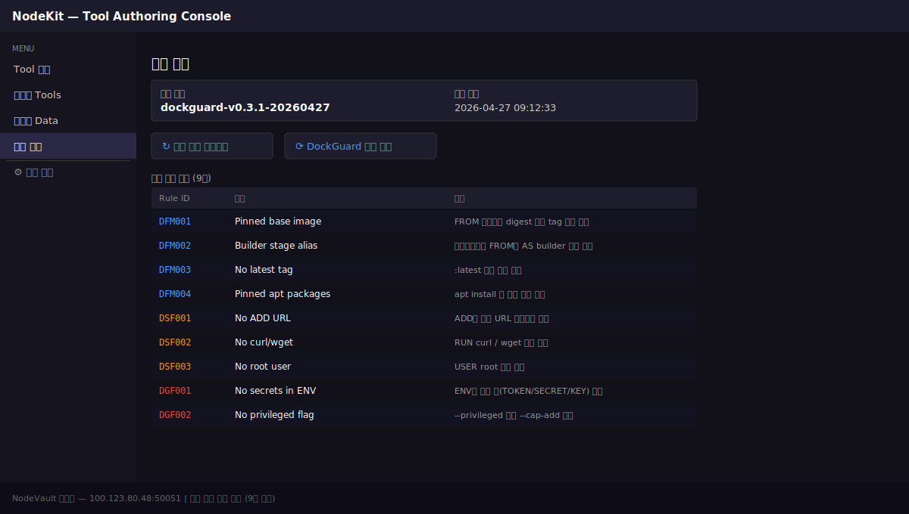
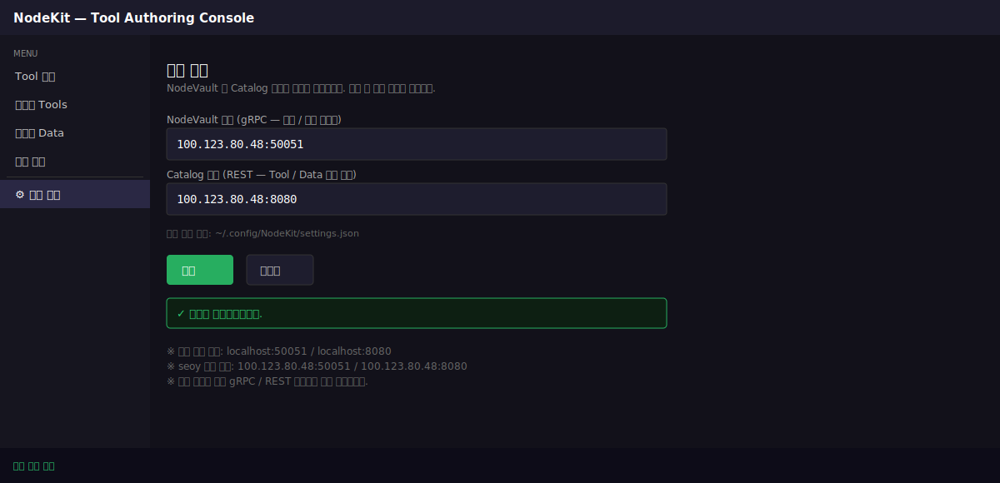

# NodeKit

**NodeKit** is an administrator desktop application for building bioinformatics analysis tools as container images and registering them on the NodeVault platform.  
Built with C# / Avalonia UI — runs on Windows, macOS, and Linux (Ubuntu).

---

## Screens

| Screen | Description |
|--------|-------------|
| **Tool Definition** | Enter image URI, Dockerfile, run script, I/O ports → L1 policy validation → send build request to NodeVault |
| **Registered Tools** | Browse tools registered in the NodeVault Catalog (with Lifecycle / Health status) |
| **Registered Data** | Browse registered reference datasets |
| **Policy Management** | View DockGuard policy bundle version and rule list |
| **⚙ Server Settings** | Configure NodeVault / Catalog service addresses (required when using from another machine) |

### Screenshots

| | |
|---|---|
|  |  |
|  |  |
|  |  |
|  | |

---

## Installation & Running

### Option 1 — Build from source (development)

```bash
# Install dependencies (requires dotnet 9 SDK)
dotnet restore

# Run
dotnet run --project NodeKit.csproj
```

### Option 2 — Self-contained Ubuntu package (for other machines)

To run on another Ubuntu machine without installing .NET runtime, build a **self-contained package**.

```bash
# Build (once, or after source changes)
make publish-linux
# or directly
dotnet publish NodeKit.csproj -c Release -r linux-x64 --self-contained true -o publish/linux-x64
```

Output is placed in `publish/linux-x64/`.

**Copy to Ubuntu machine and run:**

```bash
# 1. Copy files (SCP or rsync)
scp -r publish/linux-x64/ user@ubuntu-machine:~/nodekit/

# 2. Set executable permission
chmod +x ~/nodekit/NodeKit

# 3. Run
~/nodekit/NodeKit
```

> **Note**: Avalonia UI on Ubuntu requires an X11 or Wayland display server.  
> Works out of the box on Ubuntu with a desktop environment installed.

---

## Connecting to NodeVault from Another Machine

When running NodeKit on a laptop or another Ubuntu machine, you need to **update the NodeVault server address**.

### Option 1 — Via UI (recommended)

1. Click **⚙ Server Settings** in the left menu
2. Enter **NodeVault Address**: `<server-ip>:50051`  
   e.g. `100.123.80.48:50051`
3. Enter **Catalog Address**: `<server-ip>:8080`  
   e.g. `100.123.80.48:8080`
4. Click **Save**

Settings are persisted to `~/.config/NodeKit/settings.json` and loaded automatically on next launch.

### Option 2 — Edit config file directly

```bash
mkdir -p ~/.config/NodeKit
cat > ~/.config/NodeKit/settings.json << 'EOF'
{
  "NodeVaultAddress": "100.123.80.48:50051",
  "CatalogAddress": "100.123.80.48:8080"
}
EOF
```

---

## Key Concepts

### L1 Policy Validation (runs locally)

Before sending a build request, NodeKit runs DockGuard policies **locally via WASM** — instant feedback with no network round-trip.

| Rule | Description |
|------|-------------|
| No `latest` tag | Version pinning required for reproducibility |
| Digest `@sha256:` required | Immutable image integrity pin |
| `apt install` version pinning | Unpinned packages are blocked |
| `AS builder` alias required | Multi-stage FROM standardization |
| … (9 rules total) | See full list in the **Policy Management** screen |

### stableRef vs casHash

| Identifier | Purpose | Example |
|------------|---------|---------|
| `stableRef` | UI search, human-readable name | `BWA-MEM2@2.2.1` |
| `casHash` | Pipeline pin, immutable identifier | `d3adbeef0123…` |

Always use `casHash` when storing a tool reference in a pipeline.

---

## Architecture Overview

```
NodeKit (this app)
  │
  ├─ L1 validation (local WASM)
  │
  ├─ gRPC :50051 ──► NodeVault
  │                    ├─ L2 image build (buildah/podbridge5)
  │                    ├─ L3 dry-run (K8s)
  │                    └─ L4 smoke run (K8s)
  │
  └─ REST :8080 ──► NodePalette (Catalog)
                       └─ Registered Tool / Data list
```

For detailed design, see [CLAUDE.md](CLAUDE.md) and [docs/ARCHITECTURE.md](docs/ARCHITECTURE.md).

---

## Development Requirements

| Item | Version |
|------|---------|
| .NET SDK | 9.0+ |
| Avalonia | 11.3.13 |
| OS | Windows 10+, macOS 12+, Ubuntu 22.04+ |
